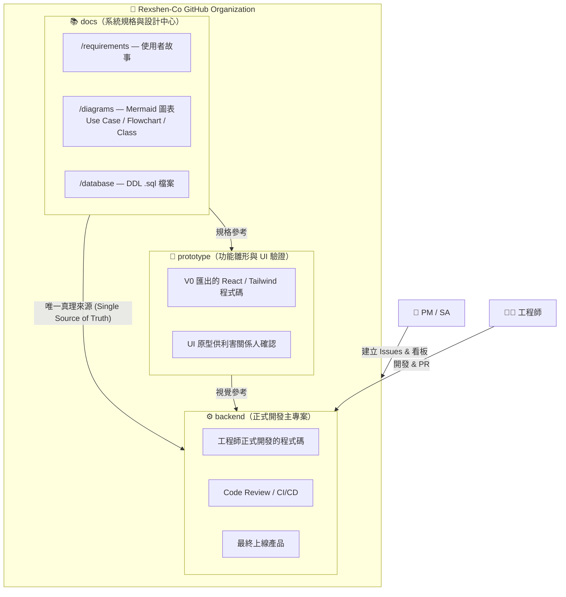
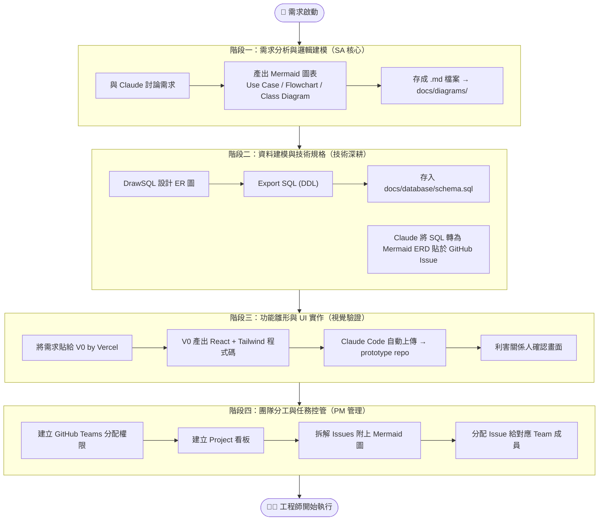
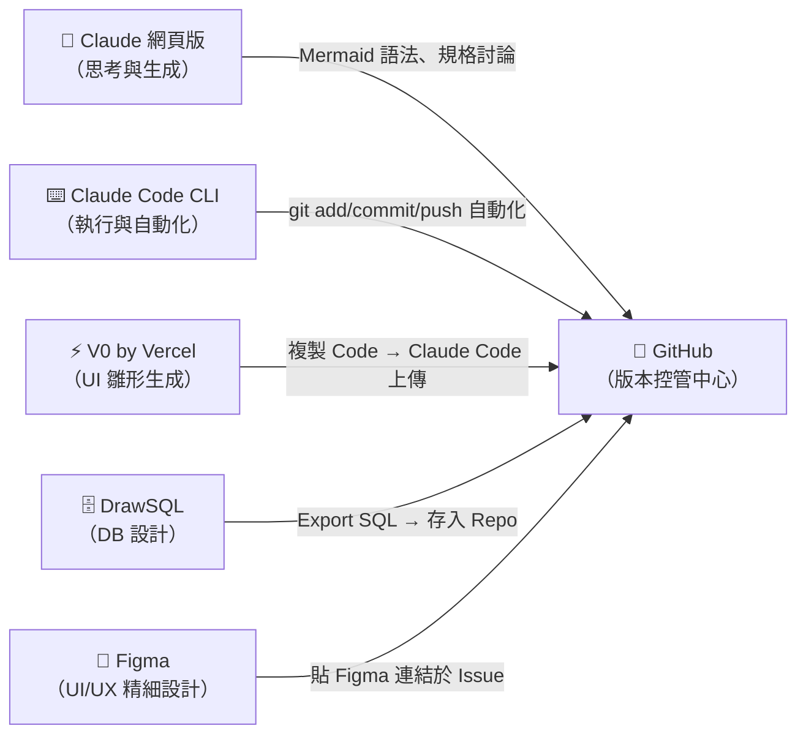
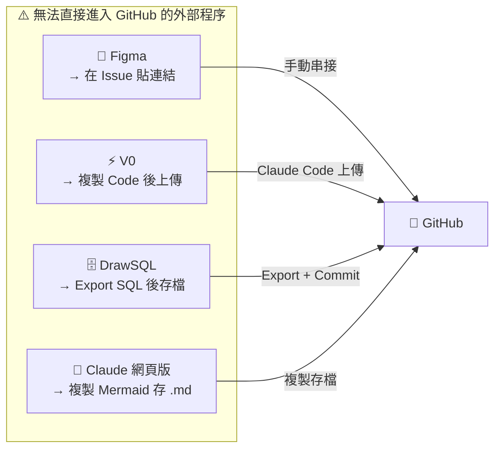

# AIDC 開發規範手冊

> AI 驅動工作流程 — 從需求到交付的完整開發指引

---

## 1. 專案架構圖（三個 Repo 的分工）



| Repo | 定位 | 主要內容 | 管理重點 |
|------|------|----------|----------|
| **docs** | 專案大腦 | 規格文件、Mermaid 圖表、SQL Schema | 所有 Issue 都應連結至此 |
| **prototype** | 專案臉面 | V0 匯出的 React 雛形 | 確認 UI 後供開發者視覺參考 |
| **backend** | 專案身體 | 正式上線程式碼 | 執行 Project 看板最頻繁之處 |

---

## 2. 開發全流程圖（SA → 設計 → 雛形 → 分工）



---

## 3. 工具與文件對照表

| 流程環節 | 產出物 | 存放位置（GitHub） | 可自動化？ | 外部對應工具 |
|----------|--------|-------------------|-----------|-------------|
| 需求展開 | Use Case / Flowchart / Class Diagram | `docs/diagrams/*.md`（Mermaid） | ✅ 生成代碼 | Claude 網頁版 |
| 資料設計 | SQL 檔案（DDL）、ER 圖 | `docs/database/schema.sql` | ✅ 修改與 Commit | DrawSQL 編輯器 |
| 介面雛形 | React / Tailwind 程式碼 | `prototype/src/` | ✅ 一鍵 Push | V0 編輯器 / Figma |
| 任務分工 | GitHub Issues / Project Board | Project Board + Issues | ⚠️ 部分（可用 CLI 開 Issue） | 無 |
| 正式開發 | 上線程式碼 | `backend/` | ✅ PR / CI/CD | IDE（VS Code 等）|



---

## 4. 無法直接進入 Git 的外部程序清單

以下工具屬於「外部連結」或「編輯環境」，內容變動無法被 Git 追蹤，需手動串接：

| 工具 | 對應流程 | 無法進 Git 的原因 | 正確串接方式 |
|------|----------|-----------------|-------------|
| **Figma** | UI/UX 精細設計 | 雲端即時協作，Git 無法管轄內容變動 | 在 GitHub Issue 中貼上 Figma 連結 |
| **V0 互動介面** | 雛形展示 | 線上編輯環境不可匯出為 Git 物件 | 複製程式碼，由 Claude Code 上傳至 `prototype` Repo |
| **DrawSQL 畫布** | ERD 視覺化設計 | 拖拉操作無法存成 Git 可追蹤的格式 | Export SQL → 將 `.sql` 存入 `docs/database/` |
| **Claude 網頁版** | 需求討論、圖表生成 | 對話內容不進版控 | 將生成的 Mermaid 語法複製存為 `.md` 文件 |



---

## 快速操作指令

```bash
# SA 啟動 — 將 Mermaid 圖存入 docs
git add diagrams/use-case.md && git commit -m "feat: add use case diagram"

# 雛形上傳 — V0 程式碼由 Claude Code 推送
git add . && git commit -m "feat: add V0 prototype" && git push origin main

# 資料庫 Schema 版控
git add database/schema.sql && git commit -m "feat: update db schema"
```

---

*本手冊由 Claude Code 根據 AI 驅動工作流程文件自動生成，並持續維護於 `docs` Repo。*
